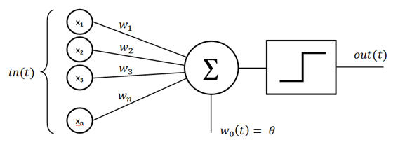
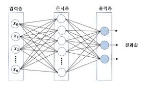

**Weekly I learned!**  
=================
## **1. 인공지능이란?**  
* 동적 컴퓨팅 환경에 내장된 알고리즘을 생성하고 적용하여 인간의 지능을 모방하는 기초 지능, 학습, 창조, 이미지 인식 등과 같이 주로 인간 지능과 연결된 인지 문제를 해결하는데 주력하는 컴퓨터 공학 분야  
## **2. AI/ML/DL의 차이**  
* $$DL \in ML \in AI $$  
    * AI : 인간의 지능과 연결된 인지문제를 해결하는 알고리즘  
    * ML : 데이터로부터 특징을 학습하는 알고리즘  
    * DL : 신경망(Neural Network)를 기반으로 특징을 학습하는 알고리즘
## **3. 데이터를 학습하는 방식**  
* 지도학습 
    * 정답이 존재하는 데이터를 이용하여 학습하는 방법  
    입력데이터와 그에 대응하는 정답(라벨)이 함께 제공되는 학습 방법  
    * ex) 분류(Classification)와 회귀(Regression)
* 비지도학습  
    * 라벨이 없는 데이터를 사용하여 학습하는 방법  
    정답 라벨이 없는 데이터를 비슷한 특징끼리 군집화 하여 새로운 데이터에 대한 결과를 예측하는 방법  
    * ex) 클러스터링(Clustering)  
* 준지도학습  
    * 지도학습과 비지도 학습을 결합한 머신 러닝의 한 유형으로, 레이블이 지정된 데이터와 지정되지 않은 데이터를 사용하는 학습 방법, 소량의 고품질 레이블 데이터와 대량의 레이블 없는 데이터를 결합하여 학습  

* 자가지도학습  
    * 데이터 자체에서 스스로 레이블을 생성하여 학습에 이용하는 방법,레이블 없는 데이터에서 자동으로 지도 신호를 생성하여 학습  

## **4. DL의 구성요소**  
* 1.Data  
    * 정형 데이터(ex)표,table) <-> 비정형 데이터(ex)이미지, 텍스트, 음성)  
    데이터의 종류: 학습데이터, 검증데이터, 테스트 데이터
    * 데이터의 양과 품질에 따라 인공지능의 성능이 달라진다(ex)과적합 문제)  
* 2.Model  
    * 입력된 데이터에서 특징을 추출하여 원하는 결과를 변환하는 구조, 사람이 정보를 처리하는 방식을 모방하는 것  
    * ex) CNN, RNN, GAN, RL, Transformer  
* 3.Loss function(손실 함수)  
    * 머신러닝이나 딥러닝 모델이 예측한 값과 실제 값 사이의 차이를 측정하는 함수  
    * ex) MSE(Mean Squared Error), Binary Cross-Entropy  
## **5. 분류 과정**  
* 1.데이터 포인트 표현(Feature 값 추출)  
    * 여러 값들에 따라 수치화하여 데이터를 그래프에 표현  
* 2.두 그룹을 가장 잘 나누는 선을 찾기  
    * 퍼셉트론: 이진 분류 모델을 학습하기 위한 지도학습 기반의 알고리즘, 오류를 최소화하는 방향으로 학습  
        * 단층 퍼셉트론: 층(layer)이 하나만 존재하는 퍼셉트론, 선을 그어 구분 한다면 XOR문제 해결 불가능한 한계가 존재
        
        * 다층 퍼셉트론: 단층 퍼셉트론의 한계점을 해결  
          
* 인공 신경망(ANN)  
    * 입력 데이터와 출력 데이터의 관계를 학습하고 모델링하는 알고리즘  
    * ex)다층 퍼셉트론, CNN, RNN  
    * "인공신경망"이라는 이름은 이 모델의 영감의 출처  
* 역전파  
    * 순전파: 뉴럴 네트워크 모델의 입력층부터 출력층까지 순서대로 변수들을 계산하고 저장하는 것  
    * 역전파: 순전파의 과정을 역행하는 과정으로 오차를 기반으로 가중치 값들을 업데이트하기 위하여 사용함

