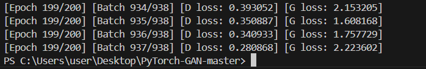
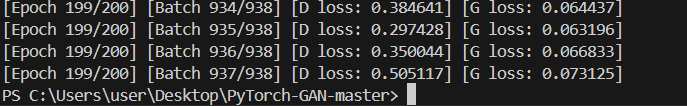

**Weekly I learned!**  
=================  
## **이미지 변환** ##  
* 종류: text to image, image+text to image, Super Resolution Model, Style Transfer Mode 등등
* 판단기준이 모호하여 이미지 생성 학습의 어려움이 있습니다.
* VAE  
    * 구조: encoder -> Latent space -> decoder  
    * encoder: 입력 값이 주어졌을 때 latent vetor z의 분포를 추정하는 역할  
    * decoder: latent vetor z을 입력 값으로 변환하는 역할  
    * latent space: decoder가 data를 생성할 수 있도록 하는 역할, noise를 sampling하여 latent space를 만듦으로써 latent space가 input과 같아지는 것을 막습니다.  
* GAN  
    * 생성모델은 최대한 진짜 같은 데이터를 생성하고 분류 모델은 진짜와 가짜를 구분하기 위한 학습을 하는 것을 말합니다.  
    * 손실함수: $ minmaxV(D,G) = E_{x~p_{data}(x)}[logD(x)]+E_{z~p_{z}(z)}[log(1-D(G(z)))] $ (D:분류 모델이 정확히 분류할 확률을 최대값으로 만드는 것), (G: D가 제대로 분류하지 못하도록 진짜와 비슷하게 만드는 것 = $[log(1-D(G(z)))]$ 를 최소값으로 만들려는 것)  
    * DCGAN: fully-connected로 구성 되어 있었던 생성모델과 분류모델을 convolution으로 대체 구성하여 성능과 안전성을 높인 구조를 말합니다. 특이한 점으로는 padding을 더하고 convolution하는 과정에서 feature map의 크기가 점점 더 커진다는 점입니다  

------
## **generation model 코드** ##  
* GAN 실행:   
* Adversarial Autoencoder 실행: 
* StarGAN는 돌리는 과정에서 데이터 파일을 다운받는데 계속 오류가 나서 못했습니다.

